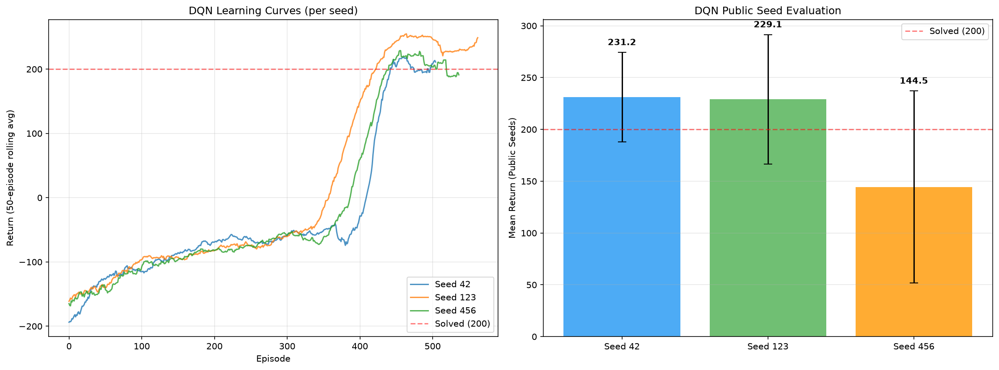

# LunarLander-v3 RL Challenge 🚀


This repository contains the complete implementation for the **LunarLander-v3** Reinforcement Learning challenge. The goal of this project is to successfully land the lunar module on the landing pad using deep reinforcement learning algorithms implemented **from scratch** in PyTorch.

## 🧠 Implemented Algorithms

Two different tracks were successfully implemented and evaluated within a strict compute budget of 150,000 environment steps per seed:

1. **Deep Q-Network (DQN)** - *Primary Track*
   - Off-policy value-based learning.
   - Includes Experience Replay and Target Networks.
   - Smoothly solves the environment (Public Evaluation Score > 200).
   
2. **Proximal Policy Optimization (PPO)** - *Bonus Track*
   - On-policy actor-critic algorithm.
   - Uses Generalized Advantage Estimation (GAE) and clipped surrogate objective.

## 📂 Repository Structure

- `agent.py`: The unified interface for loading the trained policy and returning greedy actions.
- `dqn_agent.py` / `train_dqn.py`: Implementation and training loop for the DQN agent.
- `ppo_agent.py` / `train_ppo.py`: Implementation and training loop for the PPO agent.
- `checkpoints/`: Contains the best-performing model weights (`.pt`) and evaluation data (`.json`).
- `plots/`: Visualizations of the learning curves for both agents across multiple random seeds.
- `report.md`: A concise 3-page report discussing hyperparameters, training variance, and algorithmic choices.
- `training_notebook.ipynb`: Executed Jupyter notebook containing inline plots, training metrics, and evaluations.

## 📊 Performance (DQN)

The DQN agent solved the environment within the constrained step limit, achieving the following mean return across the public seeds:

| Seed | Public Eval Return |
|------|--------------------|
| 42   | **231.2 ± 43.1**       |
| 123  | 229.1 ± 62.4       |
| 456  | 144.5 ± 92.6       |

*DQN Learning Curves:*


## ⚙️ Usage

To load the pre-trained best agent and evaluate it, you can simply use `agent.py`:

```python
import gymnasium as gym
from agent import load_policy

# Load the trained DQN model
policy = load_policy("checkpoints/dqn_best.pt")

env = gym.make("LunarLander-v3", render_mode="human")
state, _ = env.reset(seed=42)

done = False
while not done:
    action = policy.select_action(state)
    state, reward, terminated, truncated, _ = env.step(action)
    done = terminated or truncated

env.close()
```

## 🛠 Dependencies
- `gymnasium[box2d]`
- `torch`
- `numpy`
- `matplotlib`
- `jupyter`

## 📝 License
This project was developed as part of a Reinforcement Learning course challenge.
